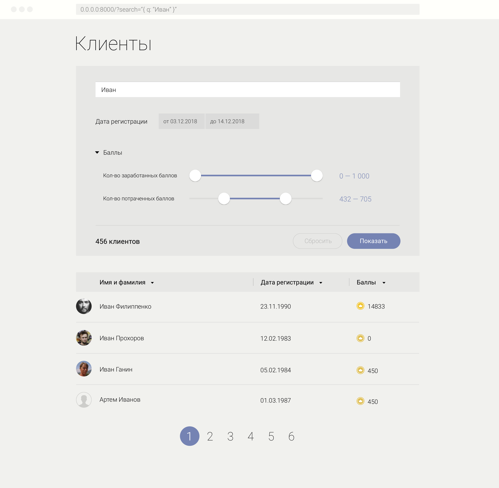

# Тестовое задание для фронт-енд разработчика

## Список с фильтрами

Написать одностраничное приложение с одним роутом.
Список с фильтрами.

### Материалы:
- Базовая верстка находится в файле `./index.html`.
- Необходимые стили `./src/theme/colors.less`.
- Данные находятся в директории `./data`.

### Требования
- Заголовки списка кликабельны, действие при нажатии – сортировка.
- Фильтры разделены на группы: строка поиска, дата регистрации, баллы. Группы состоящие из нескольких инпутов могут быть свернуты.
- Фильтры ограничены максимальным и минимальным значениями. Лимиты в файле `./data/search_limits.json`. Кнопка сбросить очищает фильтры до мин. и макс. значений.
- Фильтры принимают значения из адресной строки (формат не важен, в качестве примера параметры указаны в виде JSON строки).
- Между фильтрами "И", то есть условия должны совпадать для всех фильтров сразу.
- Поиск регистро-независимый. 
- В левом нижнем углу блока фильтров отображается количество отфильтрованных пользователей.

Задание оформить в отдельной ветке. Назвать ее на ваше усмотрение, например: имя_фамилиякандидата, и приложить пулл-реквест.

### Результат

Приложение на Vue, для запуска и просмотра необходимо выполнить следующее
- выполнить команду `yarn install`, а затем `yarn dev`
- если 8000 порт свободен, то на нем запустится webpack-dev-server
- открыть http://127.0.0.1:8000/ страницу в браузере
